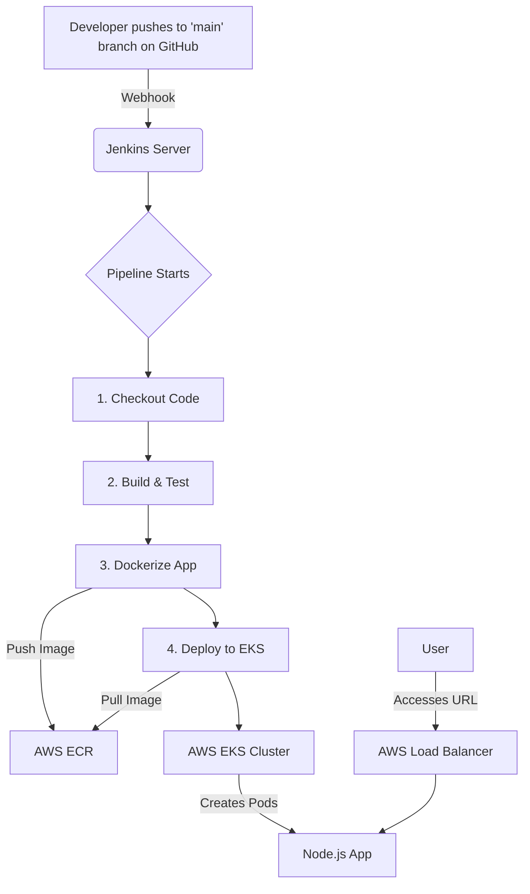

# DevOps Task: CI/CD Pipeline for a Node.js App on AWS EKS

This repository contains the source code and configuration for a fully automated CI/CD pipeline that deploys a Node.js application to an AWS EKS cluster.

## Architecture Diagram



## 🚀 Setup & Deployment

**Prerequisites:**
* AWS Account with CLI configured
* Terraform installed
* Jenkins server with required plugins (`Docker`, `AWS ECR`, `Kubernetes CLI`)
* GitHub Personal Access Token

**Instructions:**
1.  **Fork and Clone**: Fork this repository and clone it locally.
2.  **Infrastructure Setup**:
    ```bash
    cd terraform/
    terraform init
    terraform apply
    ```
    Note the `ecr_repository_url` and `eks_cluster_name` from the output.
3.  **Configure Jenkins**:
    * Add your AWS credentials (ID: `aws-credentials`) and GitHub token.
    * Create a new Pipeline job pointing to this repository's `dev` branch.
    * Update the `Jenkinsfile` environment variables with the Terraform outputs.
4.  **Trigger the Pipeline**: Push a commit to the `dev` branch. The pipeline will automatically build and deploy the application.
5.  **Access the Application**:
    * Run `kubectl get service devops-app-service` to find the public URL under `EXTERNAL-IP`.
    * It may take a few minutes for the Load Balancer to become active.

## Pipeline Flow

1.  **Checkout**: Clones the source code from the triggering GitHub branch.
2.  **Build & Test**: Installs npm dependencies and runs `npm test` inside a clean Node.js container.
3.  **Dockerize**: Builds a Docker image of the application and tags it with the Jenkins build number. It then pushes this image to the AWS ECR repository.

4.  **Deploy to EKS**: Jenkins authenticates with the EKS cluster, updates the Kubernetes deployment manifest with the new image URL, and applies the configuration using `kubectl apply`. This triggers a rolling update of the application pods.
